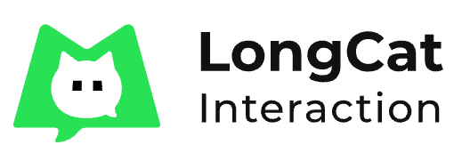

<div align="center">

**Meituan LongCat Interaction Team**
</div>

# CoIPO

## Paired FLAN dataset

CoIPO/contrastive_flan_data_new.csv

## NoisyPromptBench

CoIPO/promptbench/config.py: PROMPT_SET_Promptbench_adv

## Train

```
python run_contrastive_llama.py \
    --lora_target_modules q_proj v_proj k_proj o_proj \
    --do_train \
    --batch_size 64 \
    --cutoff_len 256 \
    --data_path "contrastive_flan_data_new.csv" \
    --val_set_size 2000 \
    --do_contrastive TRUE \
    --output_dir "llama_coipo" \
    --lora_r 16 \
    --lora_alpha 16 \
    --num_epochs 1 \
    --contrastive_loss_ratio 1000
```

```
python run_contrastive_qwen.py
--lora_target_modules q_proj v_proj k_proj o_proj
--do_train
--batch_size 64
--data_path "contrastive_flan_data_new.csv"
--val_set_size 2000
--do_contrastive TRUE
--output_dir "qwen_coipo"
--lora_r 16
--lora_alpha 16
--num_epochs 1
--cutoff_len 256
--contrastive_loss_ratio 1000
```

## Test

```
python run_contrastive_qwen.py
--lora_target_modules q_proj v_proj k_proj o_proj
--do_predict
--perturb_method clean
--promptbench_eval_task mnli
--eval_sample_cnt 300
--resume_from_checkpoint "qwen_coipo"
--output_dir "out_qwen_coipo"
```

```
python run_contrastive_llama.py
--lora_target_modules q_proj v_proj k_proj o_proj
--do_predict
--perturb_method clean
--promptbench_eval_task mnli
--eval_sample_cnt 300
--resume_from_checkpoint "llama_coipo"
--output_dir "out_llama_coipo"
```
